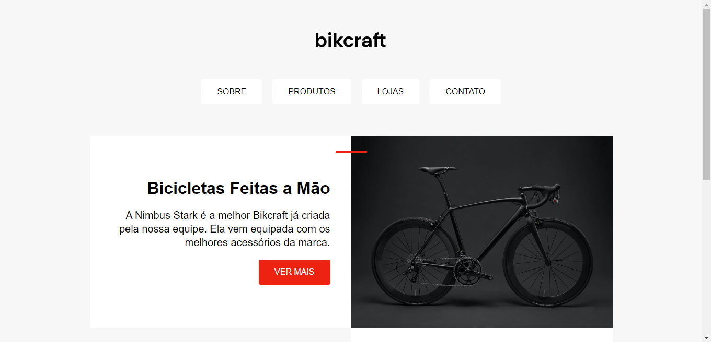
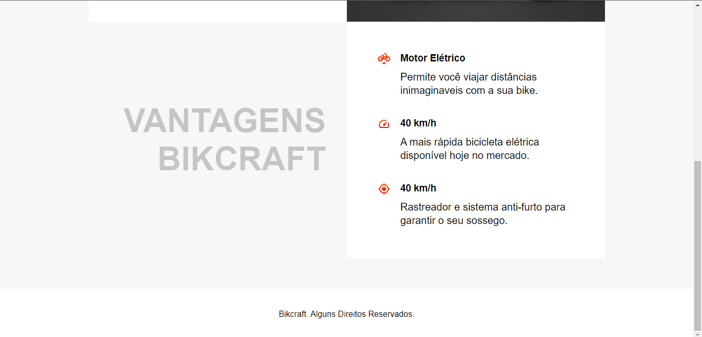

# Exercicio grid

Exercício para colocar em prática os conceitos de grid em CSS.

Você pode visualizar uma versão online do projeto [aqui](https://afraniocaires.github.io/exercicio-grid/)

## Screenshots

## Tecnologias usadas

- HTML
- CSS
